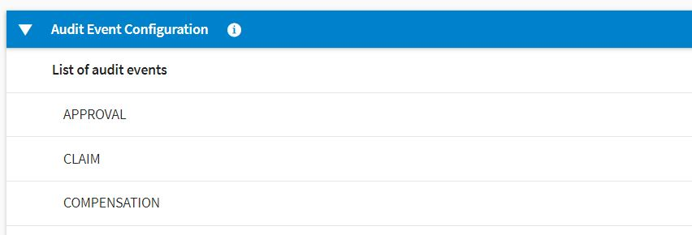
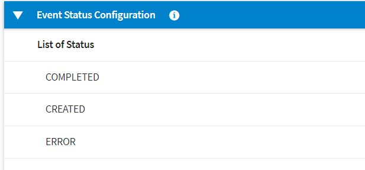
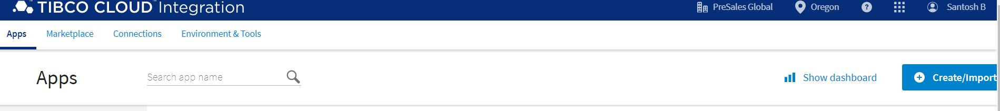
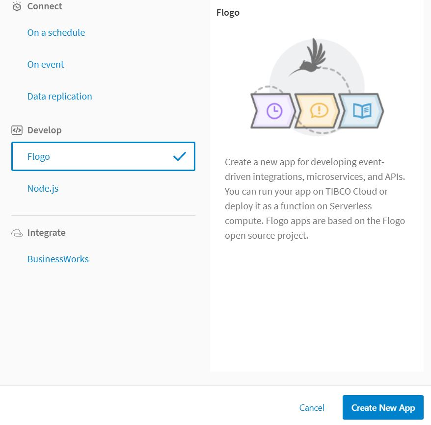
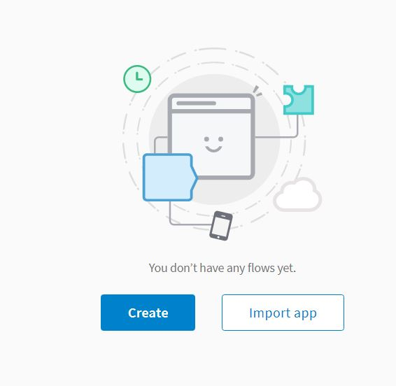
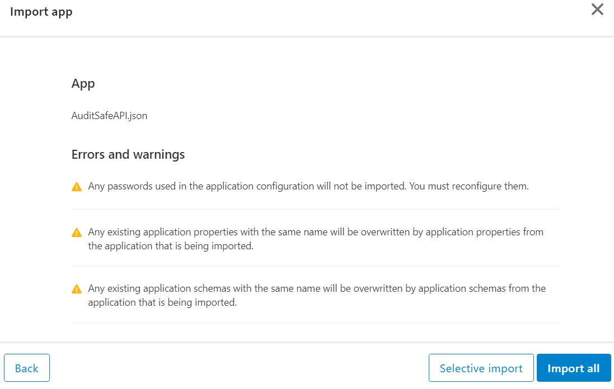
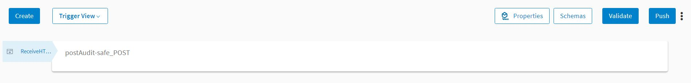
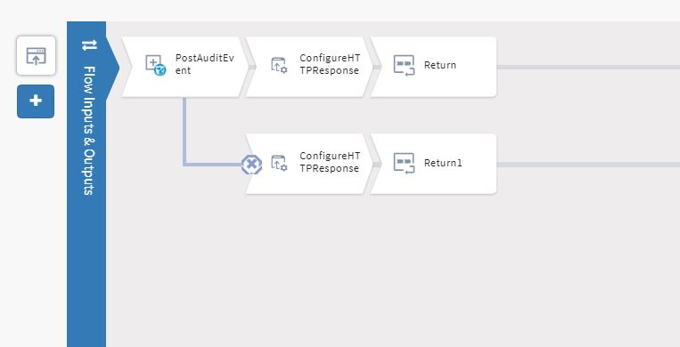

<h2>Auditsafe Application </h2>
This application sends audit information to TIBCO Auditsafe.This is an add-on if you don't use it make sure that you are also removing the Audit activity from other applications.
<b>Pre-requisite </b>
1. Make sure to have administrator access to TIBCO Audtisafe.
2. Go to Settings of Auditsafe. Add the following audit events and audit status 
    <b>Audit Event</b>  
      APPROVAL       
      CLAIM          
      COMPENSATION    
    
    <b> Audit Status</b>            
      IN PROGRESS           
      SUCCESS           
      ERROR    
 
  
  

1. Go to cloud.tibco.com and select Integration tile 
  
  
  
  

2. Select Integration apps and click on create /import button 

  
  
  

3. Select Flogo and click on Create New app 
 
  

4. Name the app and click on import flow

  

  

5. Once import is done the flow will look like this. 

  

6. Make sure the mapping is done 

7. Once the app is ready , Push app to the cloud 

  

  
  
