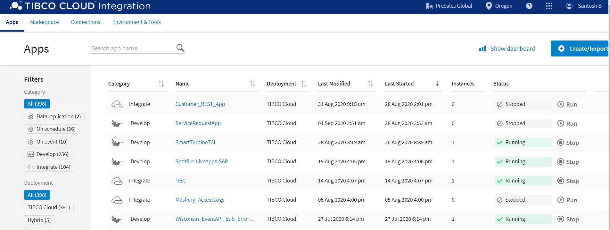
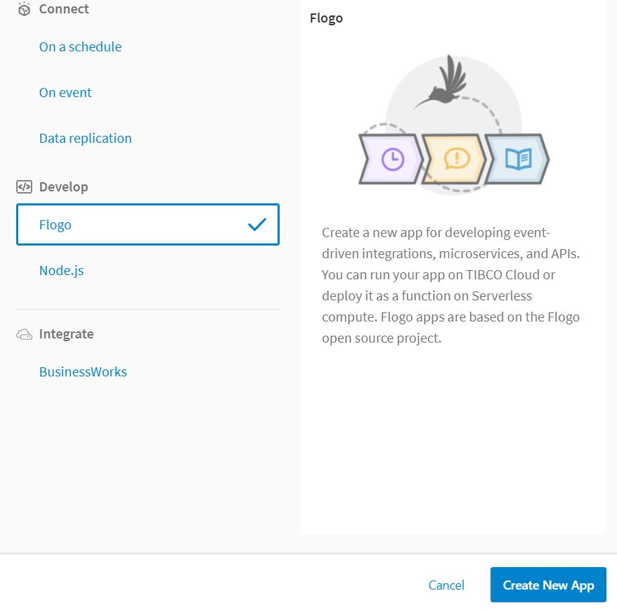

<h2> CLAIM APPLICATION </h2>

1. Go to cloud.tibco.com and select Integration tile 
  
  
  
  

2. Select Integration apps and click on create /import button 

  
  

3. Select Flogo and click on Create New app 
 
  

4. Name the app and click on import flow

  

  

5. Once import is done the flow will look like this. 

6. click on the flow and make sure that LiveAppsCreateCase activity is pointing to Insurance Claims Process. Check mapping also.

  

7. Click on the the LiveAppsGetCase activity and make sure its poinitng to Insurance Claims Process. Check Mapping also.

7. Check Audit activity and make sure it is poinging Audit Application.

8. Once the app is ready , Push app to the cloud 

