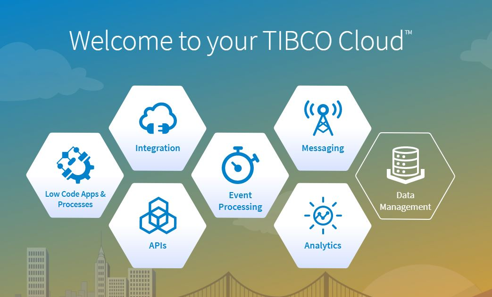
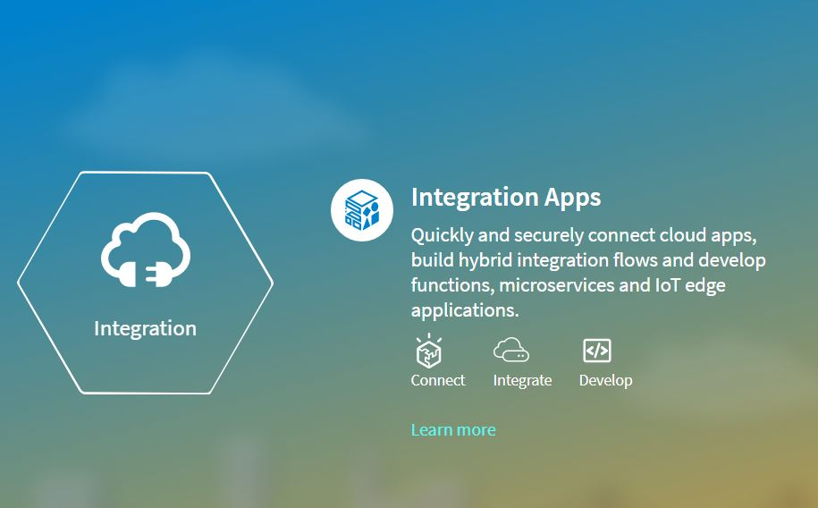

<h2>Customer Application </h2>

1. Go to cloud.tibco.com and select Integration tile 
  
  
  
  

2. Select Integration apps and click on create /import button 

  
  

3. Select Flogo and click on Create New app 
 
  

4. Name the app and click on import flow

  

5. Once import is done the flow will look like this. 

6. Click on SalesforeceQuery activity and make sure you select the Salesforce connection you have created as a prerequisite 

7. Make sure the query is "string.concat("SELECT firstName , lastName , Email , MobilePhone , MailingCity ,CustomerID__c , AnnualIncome__c  FROM Contact where CustomerID__c ='", $flow.pathParams.id,"'")"

8. Check Audit activity and make sure it is poinging Audit Application.

8. Once the app is ready , Push app to the cloud 

  
