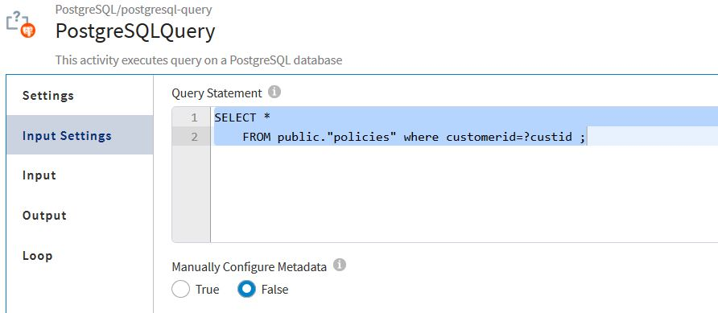

<h2>Policy Application </h2>

1. Go to cloud.tibco.com and select Integration tile 
  
  
  
  

2. Select Integration apps and click on create /import button 

  
  

3. Select Flogo and click on Create New app 
 
  

4. Name the app and click on import flow

  

  

5. Once import is done the flow will look like this. 

6. click on the flow and make sure that connection details are set in PostgreSQLQuery activity  Check SQL query and mapping also.

7. Once the app is ready , Push app to the cloud

