<h1>Executive Demo</h1>

<h2>How to Guide </h2>

Pre-requisites 

1. Create Database   https://tibco.slack.com/archives/DMSAA2B7E/p1567964447000200
	• Create a PostgreSQL database and make sure you can connect the database from TCI  
	• Import sql script given in the scripts folder into your database.  
	• Create Connection to your database from TCI.  

2. Salesforce account   
	• Go to https://developer.salesforce.com/signup and signup for a new account  
	• Once the account is ready, log in to the account and create custom fields (CustomerID, AnnualIncome) in "Contact".  
	  https://salesforce.vidyard.com/watch/y22hvtDSEpUKKPPUYGC1TX
	• Once the custom fields are created, select app- marketing, and create a new contact.  
	  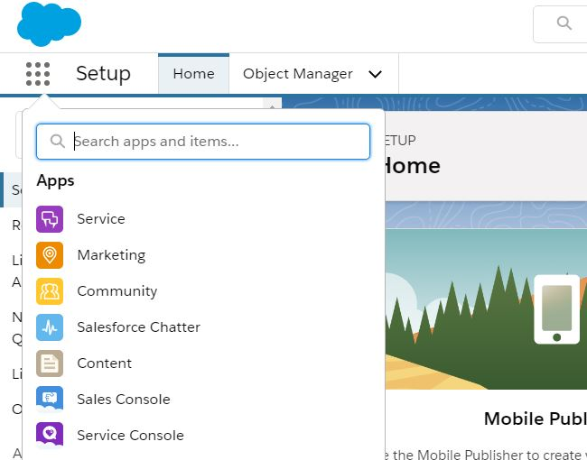
	  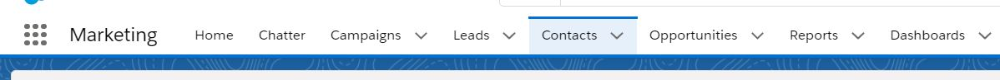
	• Fill First name, Last name, mobile, email ,CustomerID, AnnualIncome, Mailing City, and mailing Country fields.
  	  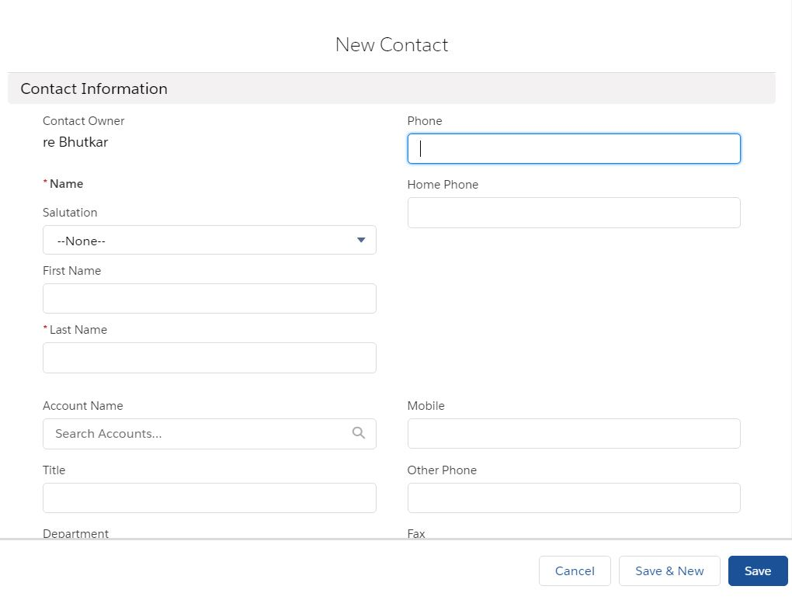
3. Create Connections  

	• Go to cloud.tibco.com and log in to your account  
	   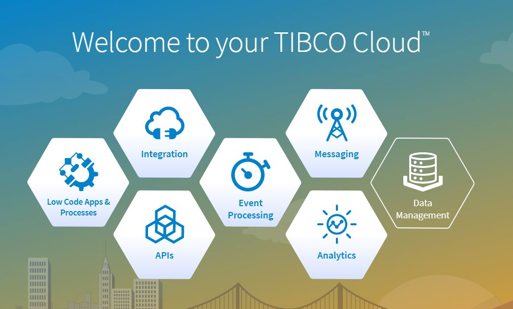
	• Select Integration tile and click on Integration apps  
	   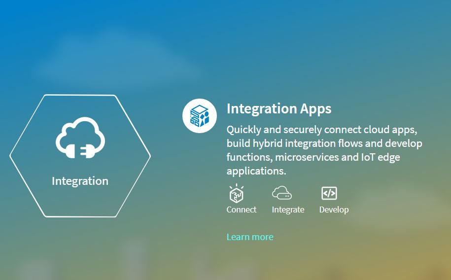
	   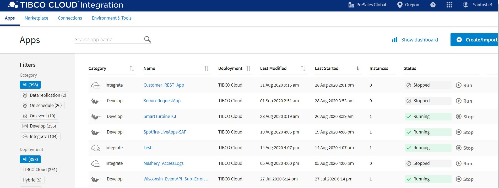
	• Create Connection to your PostgreSQL database from TCI.  
          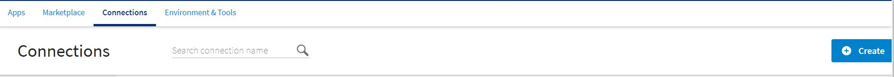 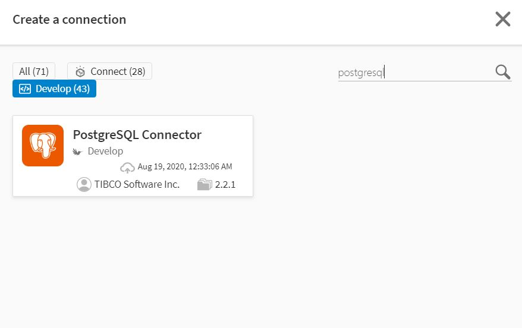 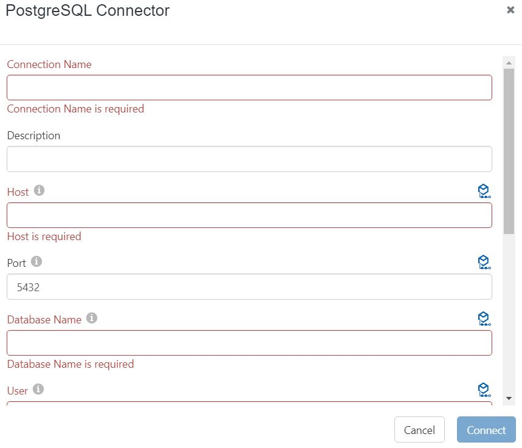
	  
	• Create Connection to your Sa;esforce account from TCI.  
	  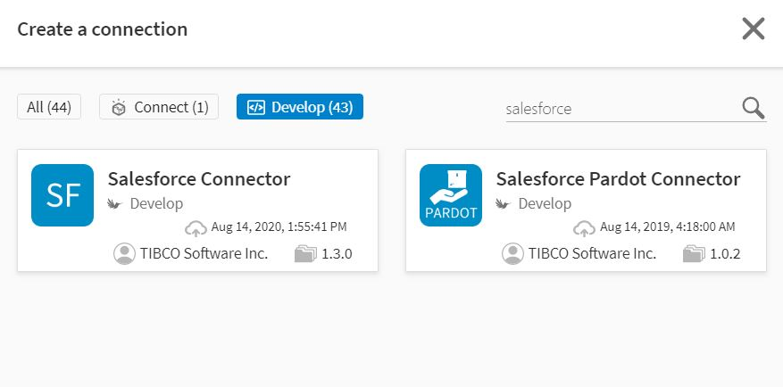 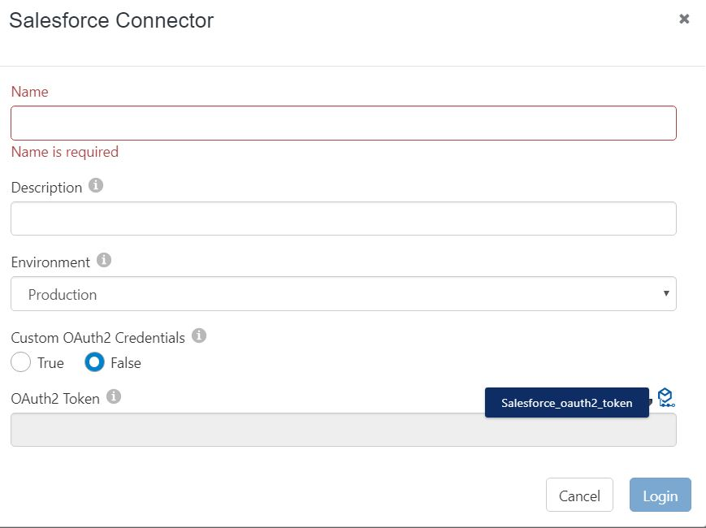
Demo 

1 API Specifications 

      
